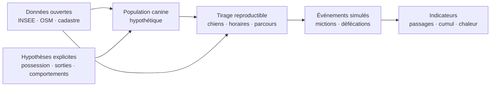

<p align="center">
  <a href="https://kifaitpipi.rue.lasegue.fr"><strong>Explorer la simulation ↗</strong></a>
  · <a href="#la-démarche-scientifique">Méthode</a>
  · <a href="#sources-et-références">Sources</a>
  · <a href="#lancer-le-projet">Installation</a>
</p>

# kifaitpipi

**Une simulation statistique des promenades et des déjections canines à Châtillon, dans les Hauts-de-Seine.**

Comment les logements, les rues et les horaires de sortie pourraient-ils répartir les promenades dans une ville ? kifaitpipi transforme des données ouvertes et des hypothèses explicites en parcours animés, en statistiques de passage et en cartes de chaleur exploratoires.

> [!IMPORTANT]
> Les rues et les parcelles sont réelles ; les chiens, les trajets et les événements sont simulés. Le projet n’a pas été calibré par des observations locales : il permet d’explorer des scénarios, pas d’identifier des personnes, des responsables ou des nuisances avérées.

## Explorer une journée

| Fonction | Ce que l’on peut explorer |
| --- | --- |
| **Promenades lumineuses** | Suivre un parcours sur les rues, jusqu’au retour au point de départ. |
| **Point d’observation** | Estimer les promenades et les événements dans un rayon de 5 à 100 m, par heure et par jour. |
| **Lecture temporelle** | Avancer, revenir en arrière, accélérer et consulter le bilan à 24:00. |
| **Cumul depuis minuit** | Conserver les portions de trajets déjà parcourues. |
| **Chaleur théorique** | Visualiser le cumul des mictions/marquages, des défécations ou des deux. |
| **Scénarios réglables** | Modifier la population canine hypothétique, les sorties, les durées et les fréquences d’événements. |
| **Cadastre et export CSV** | Lire la référence d’une parcelle et exporter les résultats avec les paramètres et la graine. |

Les mictions/marquages sont représentés en jaune pastel et les défécations en marron pastel. Les halos restent lisibles à vitesse rapide ; leur persistance à l’écran ne modifie pas les événements comptés.

La lecture démarre automatiquement après le chargement des données et le calcul du premier scénario. Le bouton pause reste disponible. Un lien GitHub discret dans le pied des réglages donne accès au code et à cette documentation.

## La démarche scientifique

Le projet suit une démarche de **modélisation exploratoire** : préciser la question, documenter les données disponibles, rendre les hypothèses modifiables, vérifier les calculs et expliciter ce qu’il reste à confronter au terrain.



### 1. Distinguer les données et les hypothèses

Les statistiques communales décrivent les habitants et les ménages. Elles ne recensent pas les chiens. Le taux de possession issu de la FACCO concerne une autre population et est utilisé comme proxy : son transfert à Châtillon est un choix de modèle.

| Entrée | Valeur initiale | Provenance et portée |
| --- | --- | --- |
| Habitants | 36 705 | [INSEE, RP2023](https://www.insee.fr/fr/statistiques/1405599?geo=COM-92020), géographie au 01/01/2026. |
| Ménages | 17 646 | Même source ; base utilisée pour calculer la population canine. |
| Taux de possession appliqué aux ménages | 22 % | [FACCO–ODOXA 2025–2026](https://www.facco.fr/chiffres-cles/les-chiffres-de-la-population-animale-2/) : possesseurs dans l’agglomération parisienne ; **proxy, sans mesure communale**. |
| Chiens par foyer équipé | 1 | Hypothèse simplificatrice, réglable. |
| Sorties par chien | 3/jour | Hypothèse de scénario. |
| Durée visée d’une sortie | 25 min | Hypothèse ; la durée obtenue dépend du parcours et des pauses. |
| Vitesse de marche | 50–80 m/min | Tirage uniforme, fixe par chien ; sans calibration locale. |
| Pics horaires en semaine | 7h30, 12h30, 18h30 | Profil supposé, décalé le week-end. |
| Mictions/marquages | 0,2/min | Repère observationnel de [Westgarth et al. (2010)](https://doi.org/10.1016/j.applanim.2010.03.007), transféré au scénario. |
| Défécations en promenade | Moyenne de 2/chien/jour | Hypothèse éclairée par des essais alimentaires ; aucune norme clinique n’est déduite. |

Les valeurs documentaires sont conservées dans [public/data/sources.json](public/data/sources.json). Les données géographiques embarquées ont été récupérées le 2 octobre 2026 ; elles ne sont pas actualisées automatiquement.

### 2. Construire une population synthétique

La population canine du scénario est calculée ainsi :

```text
N = arrondi(ménages × taux de possession × chiens par foyer équipé)
N initial = arrondi(17 646 × 0,22 × 1) = 3 882 chiens hypothétiques
```

Le moteur simule au plus **900 chiens**, chacun portant un poids `N / taille de l’échantillon`. Les passages et événements sont additionnés avec ce poids. Il s’agit d’un échantillon synthétique, pas d’un échantillon de chiens recensés sur le terrain.

Les résultats affichés sont arrondis. Un seul parcours échantillonné peut représenter plusieurs promenades : un petit nombre de parcours dans un rayon réduit rend l’estimation particulièrement sensible au tirage.

Les points de départ sont tirés selon une masse résidentielle approximative : **surface des bâtiments OSM × nombre d’étages**. Les étages manquants sont imputés ; certains bâtiments peu renseignés sont assimilés à du résidentiel. Cette pondération ne fournit pas une population mesurée à l’adresse et ne remplace pas les données INSEE à l’échelle IRIS.

### 3. Générer des promenades cohérentes avec le réseau

Le moteur conserve la plus grande composante piétonne connectée du réseau OSM. Il écarte les accès privés ou interdits renseignés, les voies `dog=no`, les voies rapides et les segments qui touchent ou traversent les contours des cimetières. Une information manquante dans OSM reste une incertitude sur l’accès réel.

Les distances utilisent une projection plane locale approximative autour de Châtillon. Les composants isolés et les déplacements hors du réseau communal retenu ne sont pas représentés ; les trajets réels qui sortent de la commune peuvent donc manquer.

L’aller explore des rues en évitant les nœuds déjà visités et en limitant les impasses. Le retour privilégie d’autres segments lorsque le réseau offre une boucle ; un accès sans alternative peut imposer un aller-retour. Jusqu’à six parcours candidats sont comparés à une distance cible liée à la durée visée.

La chronologie respecte la relation :

```text
durée obtenue = distance parcourue / vitesse du chien + durée des pauses
```

Les horaires sont tirés dans un profil à trois pics. Les sorties d’un même chien sont ensuite espacées d’au moins 30 minutes, y compris autour de minuit. Cette contrainte organise le scénario ; elle ne constitue pas une recommandation vétérinaire.

### 4. Simuler les événements avec des repères documentés

**Mictions et marquages.** Westgarth et al. (2010) étudient notamment 286 observations de promenades et rapportent un taux moyen de 0,2 miction/min au tableau 3. Les observations sont courtes, de 10 à 600 secondes : appliquer ce repère à des sorties entières suppose une extrapolation. Le modèle utilise des arrivées de Poisson, un facteur individuel uniforme entre 0,5 et 1,5 et une exposition tenant compte du temps attendu des pauses. La dispersion, la localisation le long des rues et les pauses de 15–45 secondes sont des hypothèses. [Source : article et tableau 3](https://pmc.ncbi.nlm.nih.gov/articles/PMC7132425/).

Le compteur regroupe marquage social et miction sans les distinguer. Un événement ne donne pas un volume d’urine. Les entrées OSM, souvent incomplètes, ne déterminent pas la fréquence ni la localisation des événements : aucune préférence mesurée pour une porte n’est supposée.

**Défécations.** Un nombre quotidien est tiré selon une loi de Poisson de moyenne 2, puis réparti entre les sorties proportionnellement à leur temps de marche. Des sorties plus nombreuses ou plus longues ne multiplient donc pas la moyenne quotidienne. Les pauses de 30–90 secondes et la distribution de Poisson sont des choix de scénario.

Les essais de [Tanprasertsuk et al. (2021)](https://pmc.ncbi.nlm.nih.gov/articles/PMC8279163/) et de [Cabrita et al. (2023)](https://www.frontiersin.org/journals/veterinary-science/articles/10.3389/fvets.2023.1245790/full) montrent une variabilité selon l’alimentation dans de petites cohortes. Ils éclairent un ordre de grandeur, sans mesurer la part des défécations sur la voie publique à Châtillon. Le ramassage et les éliminations dans les jardins privés ne sont pas modélisés.

### 5. Définir précisément les résultats

| Résultat | Définition | Interprétation |
| --- | --- | --- |
| Promenades par jour | Somme pondérée des promenades qui intersectent le disque d’observation, chacune comptée une fois. | Une promenade peut revenir plusieurs fois sans être recomptée dans le total journalier. |
| Promenades par heure | Somme pondérée des promenades présentes dans le disque pendant cette heure, chacune comptée une fois par heure. | Une promenade à cheval sur deux heures apparaît dans les deux ; la somme horaire peut dépasser le total journalier. |
| Événements par jour | Somme pondérée des événements situés dans le disque. | Un nombre d’événements simulés, sans estimation de volume ou de saleté restante. |
| Carte de chaleur | Cumul jusqu’à l’heure choisie, sur une grille de 10 m, lissé par un noyau normalisé de rayon 30 m. | Le lissage répartit le poids sans augmenter le nombre total d’événements. |

Le panneau d’observation décrit **la journée entière**, tandis que la chaleur s’arrête au curseur. À 24:00, le cumul est complet. Les parcours franchissant minuit sont découpés ; revenir en arrière ou changer la vitesse ne crée pas de double comptage.

L’échelle des couleurs est fixée au maximum de la journée pour le scénario et le type d’événement sélectionnés. Elle permet de lire l’évolution au cours d’une journée ; elle est recalculée lorsque le scénario change. Deux cartes de scénarios différents ne se comparent donc pas quantitativement par leur seule couleur.

### 6. Vérifier le calcul, puis confronter le modèle au terrain

Les tests automatisés vérifient la reproductibilité, la connectivité des trajets, le retour au départ, la distance/vitesse, l’espacement des sorties, les frontières horaires et minuit, l’exclusion du cimetière, les événements, la conservation des poids dans la chaleur et l’export CSV.

**Ces tests établissent une cohérence du logiciel, pas une validation empirique de ses prévisions.** L’interface affiche une seule réalisation Monte Carlo, sans moyenne de plusieurs tirages ni intervalle de confiance. L’incertitude combine le hasard du tirage, les paramètres supposés et l’incomplétude des données.

Pour transformer cette exploration en étude locale, il faudrait :

1. Recueillir des comptages anonymisés selon un protocole couvrant plusieurs lieux, heures et jours.
2. Calibrer les horaires, les durées, la population canine et les comportements sur ces observations.
3. Évaluer la sensibilité aux paramètres et à la couverture géographique, avec plusieurs graines et tailles d’échantillon.
4. Tester les résultats sur des lieux ou des jours réservés à la validation et publier les erreurs et l’incertitude.

> [!NOTE]
> Un rayon de 5 m définit une sélection géométrique dans le modèle. Il ne garantit pas une exactitude réelle de 5 m. Aucun passage simulé dans ce rayon ne prouve une absence réelle de passages.

## Reproduire un scénario

Conserver **la version du moteur, les fichiers géographiques, tous les paramètres et la graine** permet de reproduire le tirage. Le bouton « Nouveau tirage » change la graine ; il ne change pas les hypothèses.

L’export CSV du point contient les coordonnées, le rayon, les paramètres, la graine, les totaux et les résultats horaires. Pour archiver une expérience, conserver ce CSV avec le commit Git et les données utilisées : le CSV seul ne fige pas la géographie ni le moteur.

## Sources et références

| Source | Usage dans le projet |
| --- | --- |
| [INSEE — Châtillon, RP2023](https://www.insee.fr/fr/statistiques/1405599?geo=COM-92020) | Habitants et ménages. |
| [FACCO–ODOXA — baromètre 2025–2026](https://www.facco.fr/chiffres-cles/les-chiffres-de-la-population-animale-2/) | Proxy de possession canine en agglomération parisienne. |
| [API Découpage administratif](https://geo.api.gouv.fr/decoupage-administratif/communes) | Contour communal et population fournis par l’API lors de la récupération. |
| [OpenStreetMap](https://www.openstreetmap.org/#map=15/48.802/2.289) | Rues, bâtiments, parcs, restrictions d’accès et cimetières. Données sous [ODbL](https://www.openstreetmap.org/copyright). |
| [DGFiP / IGN — Parcellaire Express (PCI)](https://geoservices.ign.fr/parcellaire-express-pci) | 3 855 parcelles embarquées, filtre communal `92020`, pagination et doublons contrôlés. [Licence Ouverte 2.0](https://www.etalab.gouv.fr/licence-ouverte-open-licence/). |
| [Westgarth et al., 2010 — Dog behaviour on walks and the effect of use of the leash](https://doi.org/10.1016/j.applanim.2010.03.007) | Repère observationnel pour les mictions ; transfert exploratoire. |
| [Tanprasertsuk et al., 2021 — essai de digestibilité alimentaire](https://doi.org/10.1093/tas/txab071) | Variabilité de la fréquence quotidienne de défécation selon le régime. |
| [Cabrita et al., 2023 — supplémentation en microalgues](https://doi.org/10.3389/fvets.2023.1245790) | Autre repère alimentaire, issu de petits essais sur des Beagles. |
| [Merck Veterinary Manual — comportement social canin](https://www.merckvetmanual.com/behavior/behavior-of-dogs/social-behavior-of-dogs) · [UC Davis — marquage urinaire](https://healthtopics.vetmed.ucdavis.edu/health-topics/canine/urine-marking-dogs) | Contexte comportemental ; aucun volume ou diagnostic n’est inféré. |

La méthodologie dans l’application et le fichier des sources recensent aussi les études complémentaires sur la promenade, le milieu bâti et la variabilité du marquage. Les cohortes étrangères ou de refuge ne constituent pas une calibration locale.

## Lancer le projet

**Node.js 22.12+ ; Node 24 conseillé.**

```sh
git clone https://github.com/apeyroux/kifaitpipi.git
cd kifaitpipi
npm ci
npm run dev
```

Ouvrir `http://localhost:5173`. Les données et les polices sont embarquées ; le fond est dessiné localement, sans fournisseur de tuiles ni clé API. Le moteur s’exécute dans le navigateur, avec un Web Worker. L’application ne collecte pas de traces GPS et ne requiert aucun compte.

| Commande | Usage |
| --- | --- |
| `npm test` | Exécuter les tests du moteur, des données et des exports. |
| `npm run build:pages` | Compiler dans `dist/` et vérifier les limites Cloudflare Pages. |
| `npm run preview` | Servir localement la version compilée. |
| `npm run build:standalone` | Régénérer la page autonome avec données et polices embarquées. |
| `npm run data:fetch` | Actualiser le réseau OSM et le contour communal. |
| `npm run data:cadastre` | Actualiser les parcelles depuis le service WFS IGN. |
| `npm run deploy:cloudflare` | Compiler, vérifier et publier via Wrangler sur le projet configuré. |

### Aperçu sans npm

Ouvrir [kifaitpipi-autonome.html](kifaitpipi-autonome.html) dans un navigateur compatible avec `file://`. Cette page est un **instantané** : elle doit être régénérée après une modification. Si le navigateur bloque le fichier local, lancer `python3 scripts/preview.py` ; sur macOS, [Tester-la-page.command](Tester-la-page.command) fournit ce raccourci si Python 3 est installé. L’aperçu écoute uniquement sur `127.0.0.1`.

### Actualiser et publier

Les récupérations de données nécessitent Internet (`geo.api.gouv.fr`, les serveurs Overpass et `data.geopf.fr`). Elles valident les réponses avant de remplacer les fichiers locaux. Avec Node 24, `NODE_USE_ENV_PROXY=1` peut être nécessaire dans un environnement utilisant un proxy. Le chargement depuis « Méthodologie » reste facultatif et ne persiste pas après rechargement.

En l’absence de données géographiques utilisables, un mode de démonstration signale explicitement son fond schématique. Le cadastre affiche des limites et des références, sans propriétaires ni occupants.

La publication est décrite dans [DEPLOY-CLOUDFLARE.md](DEPLOY-CLOUDFLARE.md). Un contributeur qui héberge sa propre copie doit adapter le compte et le nom du projet dans le script. La connexion ou le jeton Wrangler reste sur le poste de publication, hors du dépôt.

## Repères dans le code

| Fichier | Rôle |
| --- | --- |
| [src/geography.js](src/geography.js) | Projection locale, import OSM, réseau accessible et cadastre. |
| [src/simulation.js](src/simulation.js) | Graine, population synthétique, horaires, parcours, événements et statistiques. |
| [src/daily.js](src/daily.js) | Découpage journalier, cumuls et lissage de la chaleur. |
| [src/export.js](src/export.js) | Export des scénarios et résultats en CSV. |
| [src/components/MapCanvas.jsx](src/components/MapCanvas.jsx) | Rendu de la carte et interactions. |
| [tests/](tests/) | Invariants et vérifications de calcul. |

Les contributions les plus utiles documentent une source, améliorent un paramètre mesurable ou ajoutent un test lié à une propriété du modèle. Toute évolution doit conserver la distinction entre données publiques, hypothèses et événements simulés.
